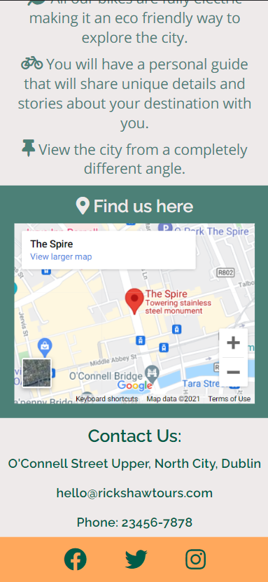
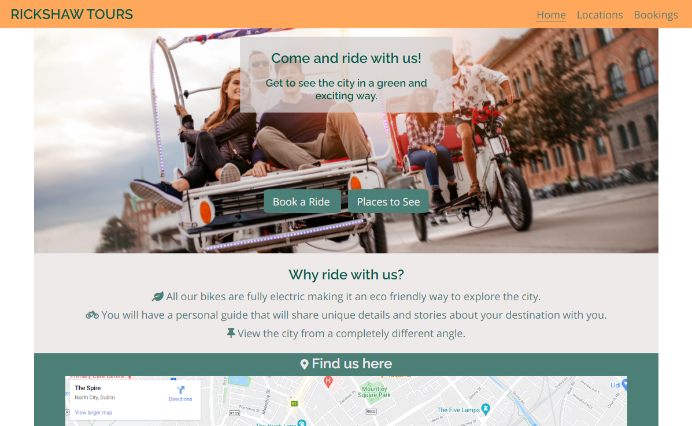
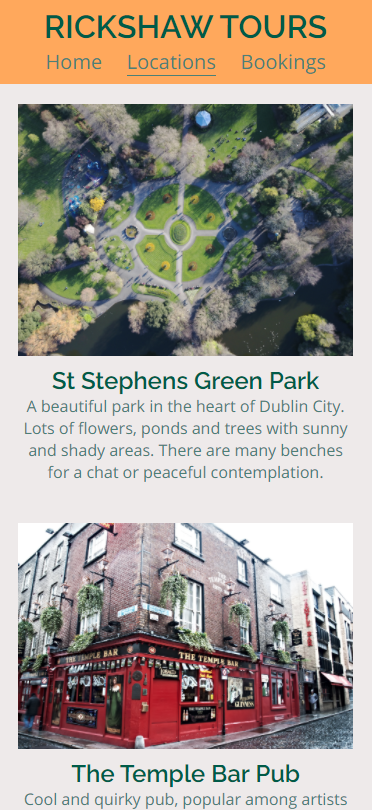
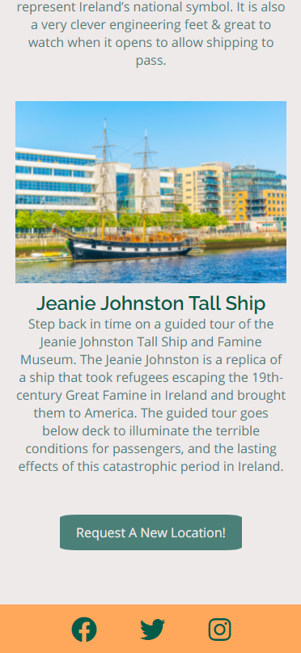

# Rickshaw Guided Tours Project

## Introduction 
Welcome to my first milestone project. This project is a website for a fictinal guided tours company that uses rickshaws and operates in Dublin, Ireland. This website gives the user a way to know the brand and book the service. It also shows the different attractions that are available to see in Dublin.

A live website can be found [here](https://marcellomuy.github.io/ci-milestone-p1/).

## Table of Contents
[1. User experience (ux) design](#ux)
  - [User Goals:](#user-goals)
  - [User Expectations:](#user-expectations)
  -	[Color Scheme:](#color-scheme)
  - [typography:](#typography)
  - [Site skeleton:](#site-skeleton)
[2. Features:](#featues)
[3.Technologies used](#technologies-used)
[4.Testing](#testing)

# 1. User experience (UX) design
[Go to the top](#table-of-contents)

A business online presence, regardless of industry, can have a massive impact on its success. Nowadays some businesses still don’t realize that a big part of their customers will visit their website before making a purchase. Having a website increases the credibility of your company and  it is a way to stand out from the others business that are offering a similar service. 

## 1.1 User Goals
  [Go to the top](#table-of-contents)

The main goal of this website is to increase the brand awareness, give out the contact information and make it easier for the costumer to request the service through the bookings page.

## 1.2 User Expectations
  [Go to the top](#table-of-contents)

Folloiwng user's expections were considered while designing the site:
* The site structure is designed to be simple and easy to use.
* The site is designed with a mobile first approach making it easier to read on small screens. 
* The user interface is easy to navigate (include a main navigation bar in the header of the page, buttons in the middle and footer at the botton with social links).
* The website is responsive on all devices sizes like mobile, tablet and desktop.
* All images on the website are of high quality. 
* To have the ability to contact the company and resquest the service.

## 1.3 Color Scheme
  [Go to the top](#table-of-contents)

  Colors are the first thing people notice when they visit a website, and the color scheme can make a huge impact on both style and consistency.
   
  [ColorSpace](https://mycolor.space/) was use to decide de colors for this design.

  Here is an example of color scheme that you can find in this website.

   

  The following colors were used to design this website:
  * #4B8078 
  * #005248
  * #FFA85C
  * #DFE0DF
  * rgba(211, 205, 205, 0.750)
  

## 1.4 Typography
  [Go to the top](#table-of-contents)

  Two fonts were used for this design. Open Sans for body elements and Raleway for main headings, Sans serif was used as backup font in both cases. 
    

## 1.5 Site Skeleton
  [Go to the top](#table-of-contents)

[balsamiq](https://balsamiq.com/) was used to create the wireframes for this website. 

The mobile version of the wireframes are presented below.

### Home Page:

### Locations Page:

### Bookings Page:

# 2. Features
  [Go to the top](#table-of-contents)

### All pages:
- Navigation bar is placed at the top of the screen with the menu centred on small screens and at the top right on large screens. It has a hover effect and an active CSS class that indicates which page the user is, improving user experience.
- Logo is place at the top and centred on small screens and top left on large screens. Works as a link for the home page.
- Social media links (for Facebook, Twitter, Instagram) are placed in the footer at the bottom of the page. All links will open in a new tab.
- The color scheme of all pages were chosen using [ColorSpace](https://mycolor.space/) with focus in contrast, consistency and a pleasant user experience.
- Buttons are consistent in all pages with a hover and border radius effect.
### Home page:
- Hero image is placed under the navigation bar and is in consistency with the website theme.
- The hero image has a heading and a paragraph that makes clear what is the purpose of the website.
- In large screens there is a box around the heading and paragraph with a background color set to improve contrast.
- At the bottom of the hero image there are two buttons that brings the user to the bookings page and locations page respectively.
- About us section is placed under the hero image with a list of reasons to why use the service. A background color and icons were used to improve the appearance and style 
- Iframe with google maps location is placed under about us section, it has a coloured padding and a heading at the top.
- Contact Us section is located just above the footer, it has all elements centred and a background color.
- The home page has a margin in both sides on large screens to improve responsiveness and style.

The screenshots of the home page are below:

  Home page UI:
  
  
   

  

### Locations page:

- This page has a gallery with pictures of attractions in Dublin. Each image has a heading with the name and a paragraph with a description of the place.
- On small screens the content is centred, for large screens the content is floated left and right.
- Request a new location button at the bottom of the page brings the user to the bookings page.

The screenshots of the locations page are below:

  Locations page UI:
  
   
  

  

### Bookings page:

- Background image in consistency with the color scheme and website theme.
- Includes a contact form that gives the ability to request a booking and ask questions.
- input type=date for selecting a date.
- The form uses radio buttons for choosing a location or requesting a new one.
- Thw form uses required attribute for essential information
- Submit button at the end.
- The form use the method="POST" action="https://formdump.codeinstitute.net/"

The screenshots of the bookings page are below:

  Bookings page UI:
  
   

  

The feedback form was correctly submitted  as  shown below:

  

  
 # 3. Technologies Used
  [Go to the top](#table-of-contents)

* [HTML5](https://en.wikipedia.org/wiki/HTML5) (markup language) was used for structuring and presenting content of the website.
 
* [CSS3](https://en.wikipedia.org/wiki/CSS) (Cascading Style Sheets) was used to provide the style to the content written in a HTML.

* [Balsamiq](https://balsamiq.com/) was used to create wireframes of the website.

* [Google Fonts](https://fonts.google.com/) was used to import font-family "Raleway" and "Open Sans" into style.css file and which was used throughout the pages of the website.

* [Font Awesome](https://fontawesome.com/) was used to import icons.

* [Chrome](https://www.google.com/intl/en_uk/chrome/) was used to debug and test the source code using HTML5 as well as to test site responsiveness.

* [Github](https://github.com/) was used to create the repository and to store the project's code after pushed from Git.

* [Gitpod](https://www.gitpod.io/) was used as the Code Editor for the site

* [ColorSpace](https://mycolor.space/) was used to generate the color scheme of the project.

* [W3C Markup](https://validator.w3.org/)  was used to validate the HTML code used in the project.

* [Jigsaw validation](https://jigsaw.w3.org/) was used to validate the CSS style used in the project.

* [Ami](http://ami.responsivedesign.is/#) was used to generate a screenshot showing responsiveness in different devices. 

  
# 4. Testing
  [Go to the top](#table-of-contents)

## 4.1 Automated testing

### Chrome DevTools
I used the developer tools to debug my code and to try different styles. When something in my code didn’t behave in the way I expected I would inspect it and try out different solutions. When I was happy with the results I would them copy and paste the code in the projects file.

### Responsive Tools
I used [Am I Responsive](http://ami.responsivedesign.is/) in conjunction with Chrome DevTools to check how the website behaved in different screen sizes.

### W3C Validator Tools 

I used [W3C Markup](https://validator.w3.org/) to check my code for any errors in the html pages.

I had an error in my index page with a closing section tag that didn’t have an opening tag. Opening section tag created to fix the error.

I had an error in my bookings page with an empty section tag that didn’t have any elements inside. Section deleted to fix the error.

I used [Jigsaw validation](https://jigsaw.w3.org/) to check my code for any CSS errors.

 
